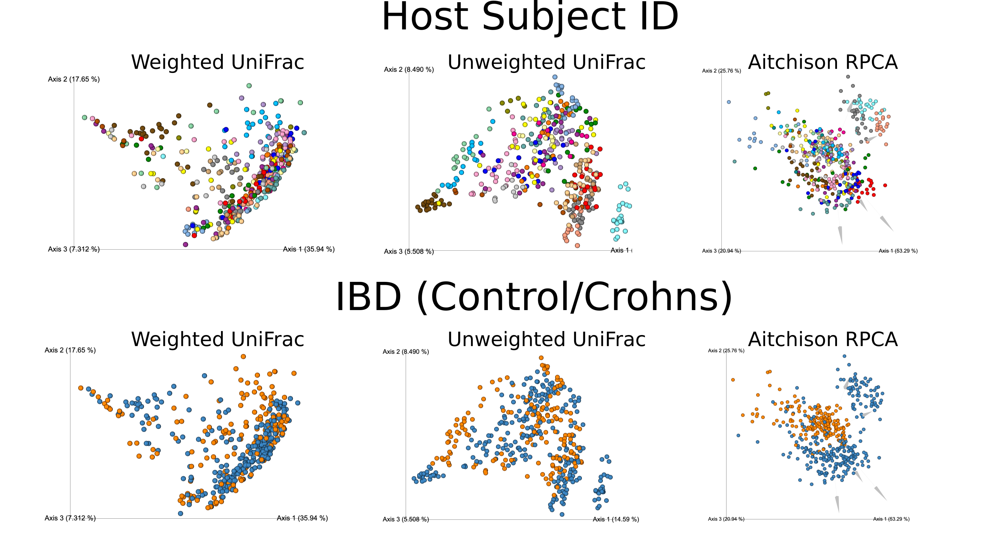
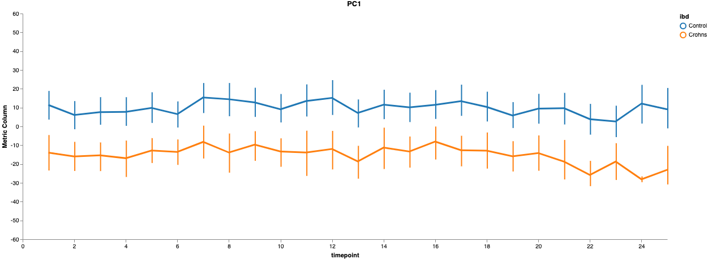
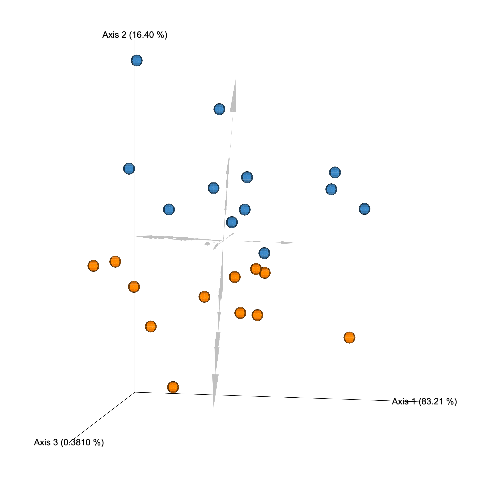
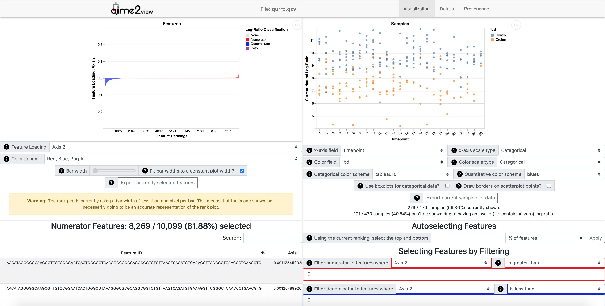
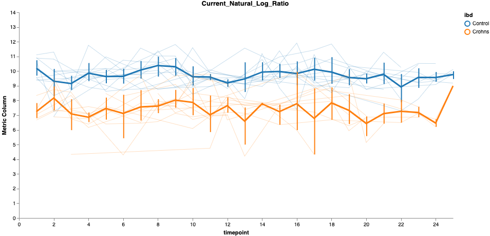
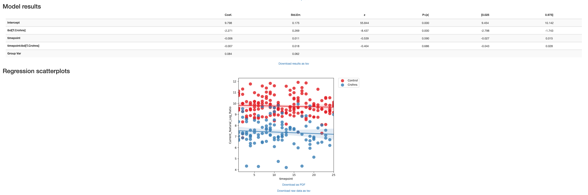

# Tutorial Introduction

Repeat measure experimental designs (e.g. time series) are valid and powerful method to control inter-individual variation. However, conventional dimensionality reduction methods can not account for the high-correlation of each subject to thierself at a later time point. This inherent correlation structure can cause subject grouping to confound or even outweigh important phenotype groupings. To address this we will use Compositional Tensor Factorization (CTF) which we provide in the software package [gemelli](https://github.com/cameronmartino/gemelli). CTF can account for repeated measures, compositionality, and sparsity in microbiome data.

In this tutorial we use _gemelli_ to perform CTF on a time series dataset comparing Crohn's and control subjects over a period of 25 weeks published in [Vázquez-Baeza et al](https://gut.bmj.com/content/67/9/1743). First we will download the processed data originally from [here](https://qiita.ucsd.edu/study/description/2538#). The pre-processed data can be downloaded with the following links:

* **Table** (table.qza) | [download](https://github.com/cameronmartino/gemelli/tree/master/ipynb/tutorials/IBD-2538/data/table.qza)
* **Rarefied Table** (rarefied-table.qza) | [download](https://github.com/cameronmartino/gemelli/tree/master/ipynb/tutorials/IBD-2538/data/rarefied-table.qza)
* **Sample Metadata** (metadata.tsv) | [download](https://github.com/cameronmartino/gemelli/tree/master/ipynb/tutorials/IBD-2538/data/metadata.tsv)
* **Feature Metadata** (taxonomy.qza) | [download](https://github.com/cameronmartino/gemelli/tree/master/ipynb/tutorials/IBD-2538/data/taxonomy.qza)
* **Tree** (sepp-insertion-tree.qza) | [download](https://github.com/cameronmartino/gemelli/tree/master/ipynb/tutorials/IBD-2538/data/sepp-insertion-tree.qza)

**Note**: This tutorial assumes you have installed [QIIME2](https://qiime2.org/) using one of the procedures in the [install documents](https://docs.qiime2.org/2020.2/install/) and have installed, [Qurro](https://github.com/biocore/qurro), [DEICODE](https://github.com/biocore/DEICODE), and [gemelli](https://github.com/cameronmartino/gemelli).

First we will make a tutorial directory and download the data above and move the files to the `IBD-2538/data` directory:

```bash
mkdir IBD-2538
```
```bash
mkdir IBD-2538/data
```

First we will demonstrate the issues with using conventional dimensionality reduction methods on time series data. To do this we will create a directory to store the results:

```bash
# make directory to store results
mkdir IBD-2538/core-metric-output
```

Now we will perform PCoA dimentionality reduction on weighted and unweighted UniFrac $\beta$-diversity distances.  
```bash
qiime diversity beta-phylogenetic\
    --i-table  IBD-2538/data/rarefied-table.qza\
    --p-metric 'unweighted_unifrac'\
    --i-phylogeny IBD-2538/data/sepp-insertion-tree.qza\
    --o-distance-matrix IBD-2538/core-metric-output/unweighted-unifrac-distance.qza
```

```bash
qiime diversity beta-phylogenetic\
    --i-table  IBD-2538/data/rarefied-table.qza\
    --p-metric 'weighted_unifrac'\
    --i-phylogeny IBD-2538/data/sepp-insertion-tree.qza\
    --o-distance-matrix IBD-2538/core-metric-output/weighted-unifrac-distance.qza
```

```bash
qiime diversity pcoa\
    --i-distance-matrix IBD-2538/core-metric-output/unweighted-unifrac-distance.qza\
    --o-pcoa IBD-2538/core-metric-output/unweighted-unifrac-distance-pcoa.qza
```

```bash
qiime diversity pcoa\
    --i-distance-matrix IBD-2538/core-metric-output/weighted-unifrac-distance.qza\
    --o-pcoa IBD-2538/core-metric-output/weighted-unifrac-distance-pcoa.qza
```

```bash
qiime emperor plot\
    --i-pcoa IBD-2538/core-metric-output/unweighted-unifrac-distance-pcoa.qza\
    --m-metadata-file IBD-2538/data/metadata.tsv\
    --o-visualization IBD-2538/core-metric-output/unweighted-unifrac-distance-pcoa.qzv 
```

```bash
qiime emperor plot\
    --i-pcoa IBD-2538/core-metric-output/weighted-unifrac-distance-pcoa.qza\
    --m-metadata-file IBD-2538/data/metadata.tsv\
    --o-visualization IBD-2538/core-metric-output/weighted-unifrac-distance-pcoa.qzv  
```
**Output:**
```bash
Saved DistanceMatrix % Properties('phylogenetic') to: IBD-2538/core-metric-output/unweighted-unifrac-distance.qza
Saved DistanceMatrix % Properties('phylogenetic') to: IBD-2538/core-metric-output/weighted-unifrac-distance.qza
Saved PCoAResults to: IBD-2538/core-metric-output/unweighted-unifrac-distance-pcoa.qza
Saved PCoAResults to: IBD-2538/core-metric-output/weighted-unifrac-distance-pcoa.qza
Saved Visualization to: IBD-2538/core-metric-output/unweighted-unifrac-distance-pcoa.qzv
Saved Visualization to: IBD-2538/core-metric-output/weighted-unifrac-distance-pcoa.qzv
```

We will also run Aitchison Robust PCA with _DEICODE_ which is built on the same framework as CTF but does not account for repeated measures.
```bash
qiime deicode rpca\
    --i-table IBD-2538/data/table.qza\
    --o-biplot IBD-2538/core-metric-output/RPCA-biplot.qza\
    --o-distance-matrix IBD-2538/core-metric-output/RPCA-distance.qza
```
```bash
qiime emperor biplot\
    --i-biplot IBD-2538/core-metric-output/RPCA-biplot.qza \
    --m-sample-metadata-file IBD-2538/data/metadata.tsv \
    --m-feature-metadata-file IBD-2538/data/taxonomy.qza \
    --o-visualization IBD-2538/core-metric-output/RPCA-biplot.qzv  
```
**Output:**
```bash
Saved PCoAResults % Properties('biplot') to: IBD-2538/core-metric-output/RPCA-biplot.qza
Saved DistanceMatrix to: IBD-2538/core-metric-output/RPCA-distance.qza
Saved Visualization to: IBD-2538/core-metric-output/RPCA-biplot.qzv
```

Now we can visualize the sample groupings by host subject ID and IBD with [Emperor](https://biocore.github.io/emperor/). From this we can see all three metric the PCoA samples clearly separate by host subject ID which in some cases (e.g. UniFrac) can overwhelm the control (blue) v. Crohn's disease (orange) sample groupings. Even in the case where the IBD grouping is not completely lost (e.g. RPCA) we can still see confounding groupings in the control (blue) groups by subject ID. In either case this can complicate the interpretation of these analysis.    



This confounding effect can also be observed in the statistics performed on pairwise $\beta$-diversity distances (e.g. PERMANOVA). In this case of exploring the distance matrices [q2-longitudinal](https://msystems.asm.org/content/3/6/e00219-18) has many excellent methods for accounting for repeated measure data. You can find the q2-longitudinal tutorial [here](https://docs.qiime2.org/2020.2/tutorials/longitudinal/).

# Compositional Tensor Factorization (CTF) Introduction

In order to account for the correlation from a subject to thierself we will compositional tensor factorization (CTF). CTF builds on the ability to account for compositionality and sparsityusing the robust center logratio transform covered in the RPCA tutorial (found [here](https://forum.qiime2.org/t/robust-aitchison-pca-beta-diversity-with-deicode)) but restructures and factors the data as a tensor. Here we will run CTF through _gemelli_ and explore/interpret the different results. 


To run CTF we only need to run once command (gemelli ctf). The required input requirements are:

1. table
    - The table is of type `FeatureTable[Frequency]` which is a table where the rows are features (e.g. ASVs/microbes), the columns are samples, and the entries are the number of sequences for each sample-feature pair.
2. sample-metadata
    - This is a QIIME2 formatted [metadata](https://docs.qiime2.org/2020.2/tutorials/metadata/) (e.g. tsv format) where the rows are samples matched to the (1) table and the columns are different sample data (e.g. time point).  
3. individual-id-column
    - This is the name of the column in the (2) metdata that indicates the individual subject/site that was sampled repeatedly.
4. state-column
    - This is the name of the column in the (2) metdata that indicates the numeric repeated measure (e.g., Time in months/days) or non-numeric categorical (i.e. decade/body-site). 
5. output-dir
    - The desired location of the output. We will cover each output independently below.  

There are also optional input parameters:

* ( _Optional_ ) feature-metadata-file
    - This is a metadata file (e.g. tsv) where the rows are matched to the table features and the columns are feature metadata such as taxonomy, gene pathway, etc... 

There are also additional optional parameter inputs which are described in the FAQ section [here](TODO).

In this tutorial out subject id column is `host_subject_id` and our state-column is different time points denoted as `timepoint` in the sample metadata. Now we are ready to run CTF:

```bash
qiime gemelli ctf\
    --i-table  IBD-2538/data/table.qza  \
    --m-sample-metadata-file IBD-2538/data/metadata.tsv \
    --m-feature-metadata-file IBD-2538/data/taxonomy.qza \
    --p-state-column timepoint\
    --p-individual-id-column host_subject_id\
    --output-dir IBD-2538/ctf-results
```
**Output:**
```bash
Saved PCoAResults % Properties('biplot') to: IBD-2538/ctf-results/subject_biplot.qza
Saved PCoAResults % Properties('biplot') to: IBD-2538/ctf-results/state_biplot.qza
Saved DistanceMatrix to: IBD-2538/ctf-results/distance_matrix.qza
Saved SampleData[SampleTrajectory] to: IBD-2538/ctf-results/state_subject_ordination.qza
Saved FeatureData[FeatureTrajectory] to: IBD-2538/ctf-results/state_feature_ordination.qza
```

We will now cover the output files being:
* subject_biplot
* state_biplot
* distance_matrix
* state_subject_ordination
* state_feature_ordination


First we will explore the `state_subject_ordination`. The subject trajectory has PC axes like a conventional ordination (i.e. PCoA) but with time as the second axis. This can be visualized through the existing q2-longitudinal plugin. 

```bash
qiime longitudinal volatility \
    --m-metadata-file IBD-2538/ctf-results/state_subject_ordination.qza \
    --p-state-column timepoint \
    --p-individual-id-column subject_id \
    --p-default-group-column ibd \
    --p-default-metric PC1 \
    --o-visualization IBD-2538/ctf-results/state_subject_ordination.qzv
```
**Output:**
```bash
Saved Visualization to: IBD-2538/ctf-results/state_subject_ordination.qzv
```

The interpretation is also similar to a conventional ordination scatter plot -- where the larger the distance is between subjects at each time point the greater the difference in thier microbial communities. Here we can see that CTF can effectively show a difference between controls and crohn's subjects across time.



There is not a strong chnage over time in this example. However, we could explore the `distance_matrix` to test the differences by IBD by looking at pairwise distances with a Mixed Effects Model. How to use and evaluate the q2-longitudinal commands is covered in depth in thier tutorial [here](https://docs.qiime2.org/2020.2/tutorials/longitudinal/).

**Note:** In the python and QIIME2 API versions of this tutorial we split by time point to run PERMANOVA. However, this is difficult using the command line interface and is skipped here.

Now we will explore the `subject_biplot` which is a ordination where dots represent _subjects_ not _samples_ and arrows represent features (e.g. ASVs). First, we will need to aggergate the metadata by subject. This can be done by hand or using DataFrames in python (with pandas) or R like so:

```python
import pandas as pd
from qiime2 import Metadata

# first we import the metdata into pandas
mf = pd.read_csv('IBD-2538/data/metadata.tsv', sep='\t',index_col=0)
# next we aggregate by subjects (i.e. 'host_subject_id') 
# and keep the first instance of 'diagnosis_full' by subject.
mf = mf.groupby('host_subject_id').agg({'ibd':'first','active_disease':'first'})
# now we save the metadata in QIIME2 format.
mf.index.name = '#SampleID'
mf.to_csv('IBD-2538/data/subject-metadata.tsv', sep='\t')
```

With out `subject-metadata` table build we are not ready to plot with emperor. 

```bash
qiime emperor biplot\
    --i-biplot IBD-2538/ctf-results/subject_biplot.qza \
    --m-sample-metadata-file IBD-2538/data/subject-metadata.tsv \
    --m-feature-metadata-file IBD-2538/data/taxonomy.qza \
    --p-number-of-features 100\
    --o-visualization IBD-2538/ctf-results/subject_biplot.qzv
```
**Output:**
```bash
Saved Visualization to: IBD-2538/ctf-results/subject_biplot.qzv
```

From this visualization we can see that the IBD type is clearly seperated in two groupings.




We can also see that the IBD grouping is separated entirely over the first PC. We can now use [Qurro](https://github.com/biocore/qurro) to explore the feature loading partitions (arrows) in this biplot as a log-ratio of the original table counts. This allows us to relate these low-dimensional representations back to our original data. Additionally, log-ratio provide a nice set of data points for additional analysis such as LME models.

```bash
qiime qurro loading-plot\
    --i-table IBD-2538/data/table.qza\
    --i-ranks IBD-2538/ctf-results/subject_biplot.qza\
    --m-sample-metadata-file IBD-2538/data/metadata.tsv\
    --m-feature-metadata-file IBD-2538/data/taxonomy.qza\
    --o-visualization IBD-2538/ctf-results/qurro.qzv
```
**Output:**
```bash
Saved Visualization to: IBD-2538/ctf-results/qurro.qzv
```

From the Qurro output `qurro.qzv` we will simply choose the PC1 loadings above and below zero as the numerator (red ranks) and denominator (blue ranks) respectively but these could also be partitioned by taxonomy or sequence identifiers (see the Qurro tutorials [here](https://github.com/biocore/qurro#tutorials) for more information). We will also plot this log-ratio in Qurro with the x-axis as time and the color as IBD, which clearly shows nice separation between phenotypes. 



We can further explore these phenotype differences by exporting the `sample_plot_data.tsv` from qurro (marked in a orange box above). We will then merge this `sample_plot_data` with our sample metadata in python or R. 

**Note:** Qurro will have an option to export all of the metadata or only the log-ratio soon.


```python
import pandas as pd

# import log-ratio data
metadata_one = pd.read_csv('IBD-2538/data/metadata.tsv',
                           sep='\t', index_col=0)
# import rest of the metadata
metadata_two = pd.read_csv('IBD-2538/ctf-results/sample_plot_data.tsv',
                           sep='\t', index_col=0)[['Current_Natural_Log_Ratio']]
# merge the data
log_ratio_metdata = pd.concat([metadata_two, metadata_one], axis=1)
# ensure no duplicate columns
log_ratio_metdata = log_ratio_metdata.dropna(subset=['Current_Natural_Log_Ratio'])
# export in QIIME2 format
log_ratio_metdata.index.name = '#SampleID'
log_ratio_metdata.to_csv('IBD-2538/ctf-results/merged_sample_plot_data.tsv', sep='\t')
```

As you can see above the metadata now has the added column of `Current_Natural_Log_Ratio` from Qurro. So now we will continue to explore this log-ratio by first plotting it explicitly over time with q2-longitudinal.

```bash
qiime longitudinal volatility \
    --m-metadata-file IBD-2538/ctf-results/merged_sample_plot_data.tsv\
    --p-state-column timepoint \
    --p-individual-id-column host_subject_id \
    --p-default-group-column ibd \
    --p-default-metric Current_Natural_Log_Ratio \
    --o-visualization IBD-2538/ctf-results/log_ratio_plot.qzv
```
**Output:**
```bash
Saved Visualization to: IBD-2538/ctf-results/log_ratio_plot.qzv
```

This can clearly show that we are recreating the separation by IBD that we saw in both the `subject_biplot` & `state_subject_ordination`. 



We can now test this difference by running a linear mixed effects (LME). 

```bash
qiime longitudinal linear-mixed-effects\
    --m-metadata-file IBD-2538/ctf-results/merged_sample_plot_data.tsv\
    --p-state-column timepoint \
    --p-individual-id-column host_subject_id \
    --p-group-columns ibd \
    --p-metric Current_Natural_Log_Ratio \
    --o-visualization IBD-2538/ctf-results/lme_log_ratio.qzv
 ```
**Output:**
```bash
Saved Visualization to: IBD-2538/ctf-results/lme_log_ratio.qzv
```

From this LME model we can see that indeed the IBD grouping is significant across time. 




