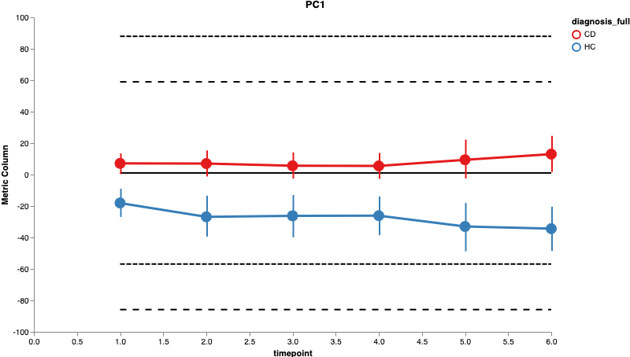
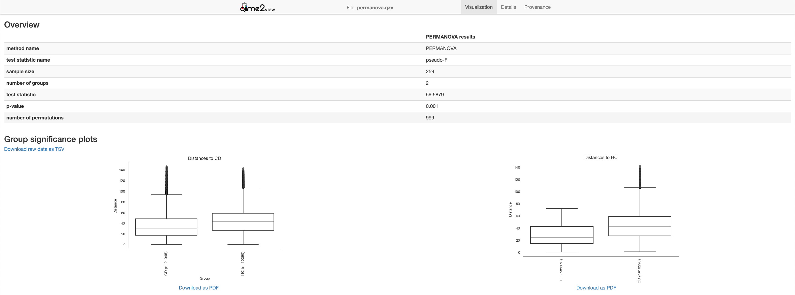

# Performing longitudinal and paired sample dimensionality reduction with gemelli

`
Note: This guide assumes you have installed QIIME 2 using one of the procedures in the install documents.
`

Gemelli resolves spatiotemporal _subject_ variation and the biological features that separate them. In this case, a _subject_ may have several paired _samples_, where each sample may be a time point. The output is akin to conventional beta-diversity analyses but with the paired component integrated in the dimensionality reduction.

This tutorial follows uses the [Jansson IBD study](https://www.nature.com/articles/nmicrobiol20174). This study follows the dynamics of the gut microbiome from in an IBD cohort consisting of 118 individuals (49 CD, 60 UC, 9 healthy controls; HC) at three-month intervals. 

## First let's preprocess the data:

`
Note: the data used here was downloaded from `[Qiita
](https://qiita.ucsd.edu/study/description/1629)`, in future tutorials a wget command will be provided.`

Before we do anything we should explore the metadata.

```bash
qiime metadata tabulate \
    --m-input-file jansson-ibd-tutorial/sample-metadata.tsv \
    --o-visualization jansson-ibd-tutorial/sample-metadata.qzv
```

By exploring the metadata (sample-metadata.qzv) in [qiime2 view](https://view.qiime2.org), we see onlya few subjects have samples at time points 7, 8, 9, & 10. So we will first filter those timepoints out.

```bash
qiime feature-table filter-samples \
    --i-table jansson-ibd-tutorial/table.qza \
    --m-metadata-file jansson-ibd-tutorial/sample-metadata.tsv \
    --p-where "timepoint < 7 AND [diagnosis_full] IN ('CD', 'HC')" \
    --o-filtered-table jansson-ibd-tutorial/filtered-table.qza
```

`Note: Taxonomic metadata is optional for gemelli but will help with interpretation.`

```bash
qiime feature-classifier classify-sklearn \
  --i-classifier etc/gg-13-8-99-515-806-nb-classifier.qza \
  --i-reads jansson-ibd-tutorial/rep-seqs.qza \
  --o-classification jansson-ibd-tutorial/taxonomy.qza
```

## Running Gemelli dimensionality reduction

This is the main function of gemelli called ctf which stands for compositional tensor factorization.  The output of this function can be visualized and used to generate summary statistics with the existing QIIME2 architecture. 

`Note: m-feature-metadata-file is not required but will help downstream interpretation.`
`Note: If there are multiple samples for a subject at a single time point then those multiple samples will be grouped and thier counts meaned.`

```bash
qiime gemelli ctf\
    --i-table  jansson-ibd-tutorial/filtered-table.qza  \
    --m-sample-metadata-file jansson-ibd-tutorial/sample-metadata.tsv \
    --m-feature-metadata-file jansson-ibd-tutorial/taxonomy.qza \
    --p-state-column timepoint\
    --p-individual-id-column host_subject_id\
    --output-dir jansson-ibd-tutorial/ctf-results
```
#### Output artifacts (in ecam-ctf-results):
* state_subject_ordination.qza
    * SampleData[SampleTrajectory]
* state_feature_ordination.qza
    * FeatureData[FeatureTrajectory]
* state_distance_matrix.qza
    * DistanceMatrix
* subject_biplot
    * PCoAResults % Properties('biplot')


## Visualizing and Summarizing output of gemelli


### Subject Trajectory

The subject trajectory has PC axes like a conventional ordination (i.e. PCoA) but with time as the second axis. This can be visualized through the existing q2-longitudinal plugin. The interpretation is also similar to a conventional ordination scatter plot -- where the larger the distance is between subjects at each time point the greater the difference in thier microbial communities. 

```bash
qiime longitudinal volatility \
    --m-metadata-file jansson-ibd-tutorial/ctf-results/state_subject_ordination.qza \
    --p-state-column timepoint \
    --p-individual-id-column subject_id \
    --p-default-group-column diagnosis_full \
    --p-default-metric PC1 \
    --o-visualization jansson-ibd-tutorial/ctf-results/state_subject_ordination.qzv
```




### Feature Trajectory

The feature trajectory helps explain what log-ratio pairs of features will differentiate the groupings seen in the subject trajectory plot. It can also be visualized using q2-longitudinal. In this case 


```bash
qiime longitudinal volatility \
    --m-metadata-file jansson-ibd-tutorial/ctf-results/state_subject_ordination.qza \
    --p-state-column timepoint \
    --p-individual-id-column subject_id \
    --p-default-group-column diagnosis_full \
    --p-default-metric PC1 \
    --o-visualization jansson-ibd-tutorial/ctf-results/state_subject_ordination.qzv
```


### Distance

The distances can be used to create summary statistics for the subject trajectories. There are several methods for analyzing temporal distances in q2-longitudinal. However, since we see the groupings separate here across all time points we can simply run pairwise PERMANOVA between the groups.

`
Note: Running PERMANOVA across all time points only makes sense if there is no interaction between time and health status, as we see here. If there is an interaction with time, LME or other longitudinally aware methods for summary statistics may be more appropriate.`


```bash
!qiime diversity beta-group-significance \
    --i-distance-matrix jansson-ibd-tutorial/ctf-results/state_distance_matrix.qza \
    --m-metadata-file jansson-ibd-tutorial/sample-metadata.tsv \
    --m-metadata-column "diagnosis_full" \
    --o-visualization jansson-ibd-tutorial/ctf-results/permanova.qzv
```




### Subject biplot

The subject biplot is similar to conventional biplots except that dots now represent subjects. Similarly, the distance between subject dots in the plot represents thier longitudinal dissimilarity. This means that a larger distance between dots is a more different longitudinal separation between those subjects. To visualize this data we will first combine static categorical metadata by _subject_ to color the biplot. Currently, this is done in python but will be added as part of the gemelli QIIME2 plugin in the future. 

```python
import pandas as pd
from qiime2 import Metadata

# first we import the metdata into pandas
mf = pd.read_csv('jansson-ibd-tutorial/sample-metadata.tsv', sep='\t',index_col=0)
# next we aggregate by subjects (i.e. 'host_subject_id') 
# and keep the first instance of 'diagnosis_full' by subject.
mf = mf.groupby('host_subject_id').agg({'diagnosis_full':'first'})
mf.index.name = "id"
# now we save the metadata in QIIME2 format.
Metadata(mf).save('jansson-ibd-tutorial/subject-metadata.tsv')
```

Now we can simply plot the resulting biplot using Emperor’s biplot functionality. The resulting biplot reveals that across all time _Enterobacteriaceae_ separates CD vs. HC subjects with respect to a species in the order _Clostridiales_ a trend which has been observed [before](https://www.ncbi.nlm.nih.gov/pmc/articles/PMC5473501/).


```bash
qiime emperor biplot\
    --i-biplot jansson-ibd-tutorial/ctf-results/subject_biplot.qza \
    --m-sample-metadata-file jansson-ibd-tutorial/subject-metadata.tsv \
    --m-feature-metadata-file jansson-ibd-tutorial/taxonomy.qza \
    --o-visualization jansson-ibd-tutorial/ctf-results/subject_biplot.qzv
```


`
Note: A visualization using log-ratios in Qurro coming soon.
`
